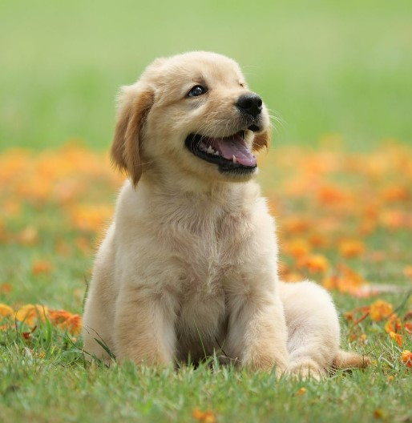
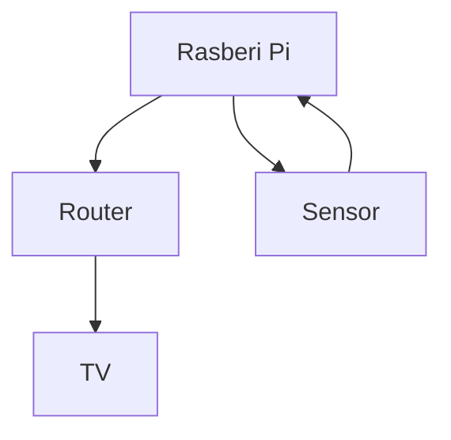
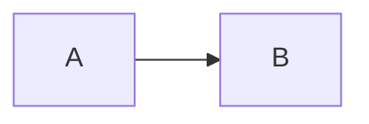

# Name
# EGL315AV

Shao Zhe

*Shao Zhe*

**Shao Zhe**

***Shao Zhe***

* Shao Zhe 

# School
### Code Block

```
I am at Nanyang 
Block S
Room 540
```
` sudo rasppi -conf `

## This is a Pic of a puppy :



Left to Right






