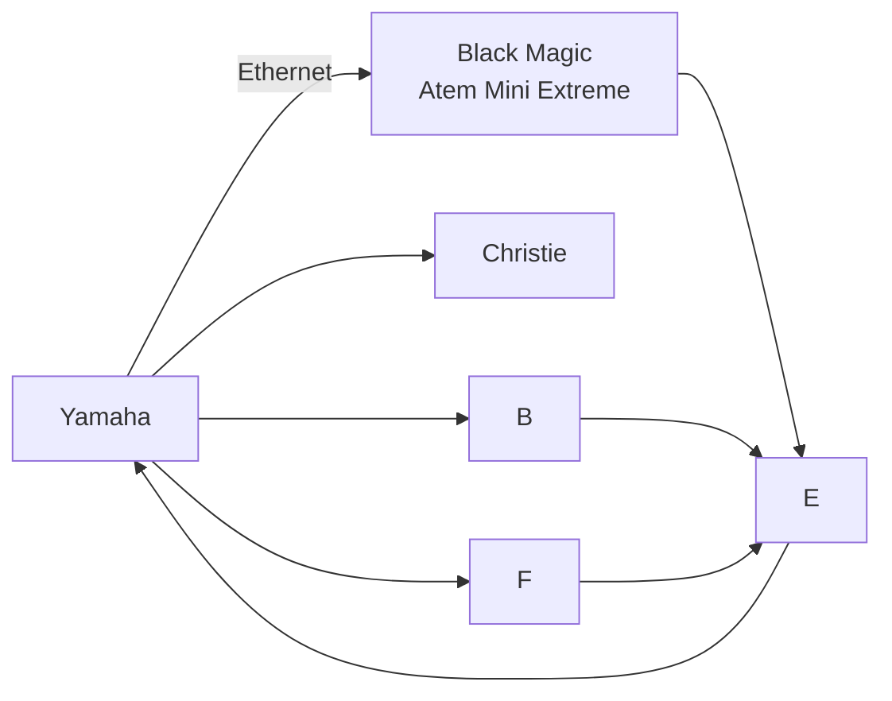
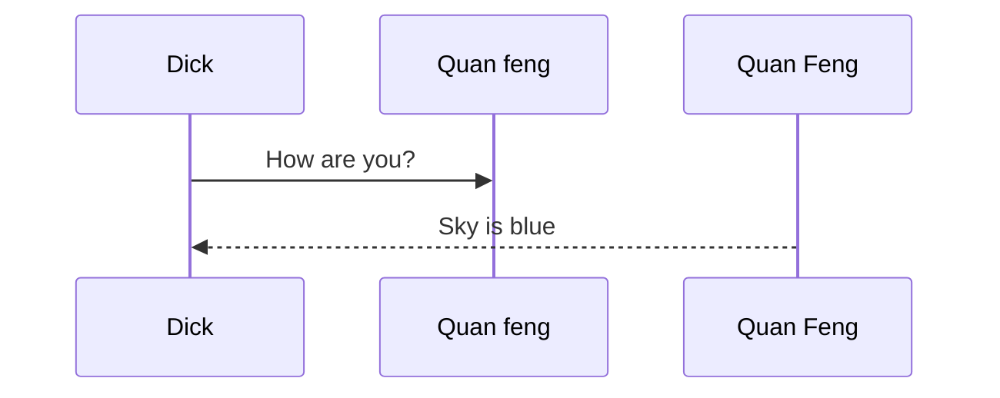

# Header 1 
## Header 2
### Header 3
#### Header 4
##### Header 5
###### Header 6

## Italize
*ITALICS*

* Chicken Rice
* Bak kut Teh
- Nasi Lemak
- Nasi Padang
+ Dim Sum
+ Chilli Crab
1. Black pepper crab 
2. Chilli Crab
3. ... Salted egg Crab

  * Pepper Kind
    * Indent 1
      * Indent 2
        * Ident 3 
           * Ident 4
              * Ident 5

# Image of a desert 


Drag and drop image from the parent folder while holding shift 

To read more please visit [here](https://www.nyp.edu.sg)


```
import tkinter 

```


# To quote Sir Isaace Newton 

> For every action, theres is an equal and
    opposite reaction 

 [*Sir Isaac Newton*](https://www.google.com)


 | Header 1 | Header 2 | Header 3|
 |---------|-----------|---------|
 | Data 1 |Data 2|Data 3 |
 |Data 1|Data2|Data3|

 # Nanyang Polytechnic 

 ## School of Engineering 

 ### Diploma in Infocomm Media Engineering 

 #### Media and System Specialization 
 ---


 ## Flowchart 




